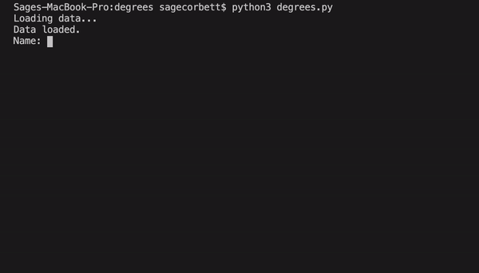

# Degrees

This AI program searches through frontier of nodes to find how many degrees away one actor is from another actor. Using a Breadth-first search algorithm



### How to run the program?
Type ```python3 degrees.py``` to load the large data set (Over a million actors)
Type ```python3 degrees.py small``` to load the small data set (Not recommended)